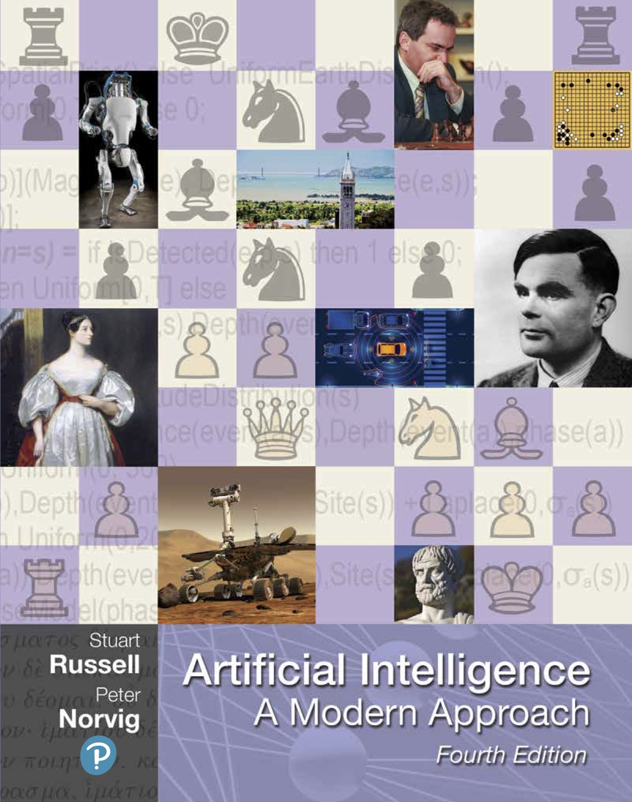

# Presentation

>Exercices from the book Artificial Intelligence : A Modern Approach 4th edition. I'm currently reading this book and I will be pushing the exercices in each chapter once I finish. There is 28 chapters in the book and roughly 20 exercices per chapters.

<pre><code>ModernApproachAIExercices/
├── exercices/
│   	├── 1_Artificial_Intelligence/   
│       │       ├── 1_Introduction/ 
│       │       └── 2_Intelligent_Agent/ 
│       ├── 2_Problem-solving/ 	 
│       │       ├── 3_Solving_Problems_By_Searching/ 
│       │       ├── 4_Beyond_Classical_Search/ 
│       │       ├── 5_Adversarial_Search/ 
│       │       └── 6_Constraint_Satisfaction_Problems/ 
│       ├── 3_Knowledge_reasoning_planning/ 	 
│       ├── 4_Uncertain_knowledge_reasoning/ 	 
│       ├── 5_Learning/ 	 
│       │       ├── 18_Learning_From_Examples/ 
│       │       ├── 19_Knowledge_In_Learning/ 
│       │       ├── 20_Learning_Probabilistic_Models/ 
│       │       └── 21_Reinforcement_Learning	 
│       ├── 5_Learning/ 	 
│       │       ├── 22_Natural_Language_Processing/ 
│       │       ├── 23_Natural_Language_For_Communication/ 	 
│       └── 7_Conclusions/ 	 	 
├── README.md		          
└── cover2.png
</pre></code>

# Book's chapter

Part I: Artificial Intelligence 
Chapter 1 - Introduction ... 1 <--- Done 
Chapter 2 - Intelligent Agents ... 36 <--- Done 

Part II: Problem-solving 
Chapter 3 - Solving Problems by Searching ... 63 <--- Done 
Chapter 4 - Search in Complex Environments ... 110 <--- Done 
Chapter 5 - Adversarial Search and Games ... 146 
Chapter 6 - Constraint Satisfaction Problems ... 180 

Part III: Knowledge, reasoning, and planning 
Chapter 7 - Logical Agents ... 208 
Chapter 8 - First-Order Logic ... 251 
Chapter 9 - Inference in First-Order Logic ... 280 
Chapter 10 - Knowledge Representation ... 314 
Chapter 11 - Automated Planning ... 344 

Part IV: Uncertain knowledge and reasoning 
Chapter 12 - Quantifying Uncertainty ... 385 
Chapter 13 - Probabilistic Reasoning ... 412 
Chapter 14 - Probabilistic Reasoning over Time ... 461 
Chapter 15 - Probabilistic Programming ... 500 
Chapter 16 - Making Simple Decisions ... 528 
Chapter 17 - Making Complex Decisions ... 562 
Chapter 18 - Multiagent Decision Making ... 599 

Part V: Machine Learning 
Chapter 19 - Learning from Examples ... 651 
Chapter 20 - Learning Probabilistic Models ... 721 
Chapter 21 - Deep Learning ... 750 
Chapter 22 - Reinforcement Learning ... 789 

Part VI: Communicating, perceiving, and acting 
Chapter 23 - Natural Language Processing ... 823 
Chapter 24 - Deep Learning for Natural Language Processing ... 856 
Chapter 25 - Computer Vision ... 881 
Chapter 26 - Robotics ... 925 

Part VII: Conclusions 
Chapter 27 - Philosophy, Ethics, and Safety of AI ... 981 
Chapter 28 - The Future of AI ... 1012 

# Links

- Book : https://www.pearson.com/us/higher-education/program/Russell-Artificial-Intelligence-A-Modern-Approach-4th-Edition/PGM1263338.html
- Exercices : https://aimacode.github.io/aima-exercises/
- Resources : http://aima.cs.berkeley.edu/
